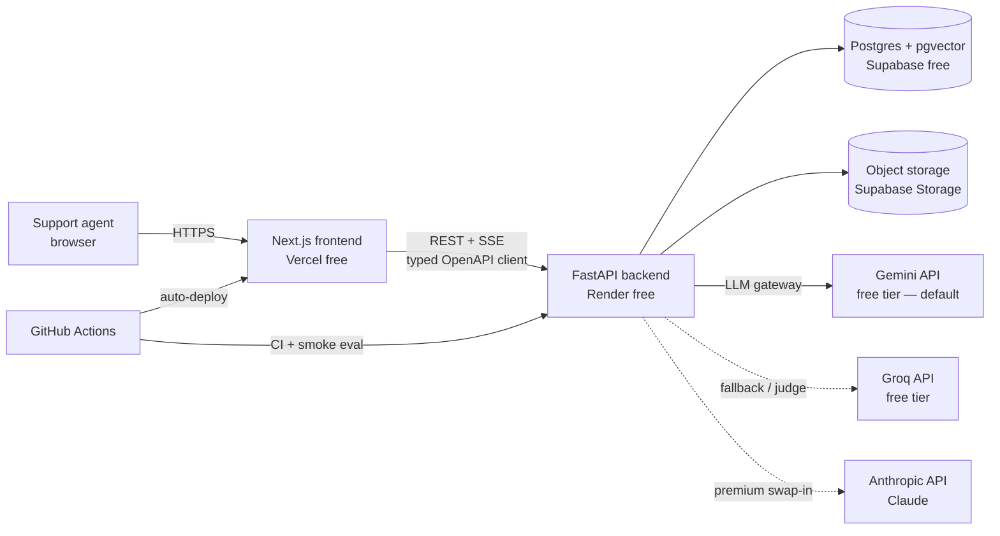
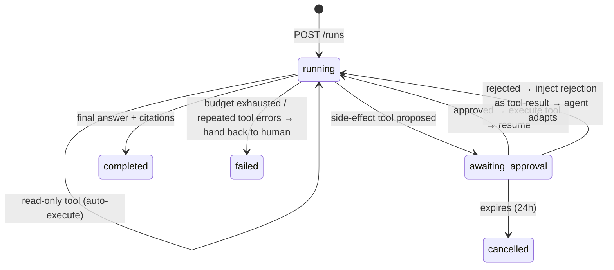

# AI Operations — Architecture

> **Status:** Proposal v0.1 (2026-07-17) — pending refinement before implementation.
> **Domain slice:** Support-resolution copilot (swappable to procurement/HR — the platform is domain-agnostic; only the seed data, tools, and prompts change).

---

## 1. What we're building

A support agent (human) logs into a web app where they can:

1. **Ingest** internal knowledge (PDF / HTML / CSV) → parsed, chunked, embedded, indexed.
2. **Ask questions / draft replies** — answers are grounded in retrieved chunks with inline citations.
3. **Let the AI act** — the copilot routes to tools: `search_knowledge_base`, `lookup_order`, `create_escalation`.
4. **Approve before side effects** — any state-changing tool call pauses the run until a human approves/rejects.
5. **Inspect every run** — full trace: retrieval hits, tool calls, per-step latency, tokens, cost, confidence.
6. **Evaluate** — a golden dataset (60–100 questions) with retrieval + answer-quality metrics, comparing configurations (before/after).

Non-functional requirements (what a company would also demand):

| Requirement | How it's met |
|---|---|
| $0 infra cost | Every service on a free tier (see §14) |
| Nothing lost on crash/restart | All agent state in Postgres; runs are resumable |
| Auditability | Immutable `run_steps` + `approvals` rows = audit trail |
| Vendor independence | Provider-agnostic LLM layer; model choice is config |
| Horizontal scalability path | Stateless API, documented swap points (§15) |
| Guardrails | Step/cost/timeout budgets; failed runs stop and hand back to human |
| Regression safety | CI smoke-eval on every PR |

---

## 2. System context



One database holds **relational data, vectors, job status, traces, and eval results**. That is deliberate — see §4.

---

## 3. Tech stack and rationale

Every choice below states the alternative considered and the condition under which you'd switch. That's the format an architecture review at a company uses.

| Layer | Choice | Why | Alternative | Switch when |
|---|---|---|---|---|
| Frontend | **Next.js 15 (App Router) + TypeScript + Tailwind + shadcn/ui + TanStack Query** | Industry-default React stack; Vercel-native deploy; shadcn gives professional UI fast | Vite SPA (simpler), Remix | Need heavy SSR/SEO → already covered; need mobile → React Native |
| Backend | **FastAPI (Python 3.12) + Pydantic v2** | Python owns the AI ecosystem (parsers, eval libs); async-first; auto-OpenAPI → typed frontend client | NestJS/tRPC (all-TS) | Team is TS-only and AI surface is thin |
| ORM/migrations | **SQLAlchemy 2 (async) + Alembic** | Industry standard; migrations as versioned code | Prisma (TS), raw SQL | — |
| Database | **Postgres 16 + pgvector (Supabase free)** | One store for relational + vector + FTS; transactional consistency; SQL joins for filtered retrieval | Dedicated vector DB (Pinecone/Qdrant) + separate Postgres | > ~5–10M vectors or heavy vector QPS |
| File storage | **Supabase Storage** | Same project as DB; S3-compatible mental model | Cloudflare R2, S3 | Multi-region / large files |
| LLM (default) | **Gemini 2.5 Flash — free tier** | Genuinely free; solid tool-calling; same API key also gives free embeddings | Groq (Llama 3.3 70B, free) | Rate limits hit during evals → split load across both |
| LLM (premium) | **Claude via official Anthropic SDK** (`claude-opus-4-8` default; `claude-haiku-4-5` for cheap steps) | Best quality for demo day; drop-in via the provider layer | — | You get API credits / interview demo |
| Embeddings | **`gemini-embedding-001` @ 768 dims** (API) | Free; keeps backend RAM tiny (Render free = 512MB — no local model) | Local ONNX (fastembed), Voyage AI free tier | Backend gets ≥2GB RAM or need offline |
| Agent orchestration | **Hand-rolled loop + explicit DB state machine** | The approval gate *is* the product; owning the loop shows real understanding; no framework churn | LangGraph (has interrupts/checkpointers built in) | Team velocity > learning value |
| Streaming | **SSE (Server-Sent Events)** | Unidirectional token stream; proxy/CDN friendly; auto-reconnect | WebSockets | Need bidirectional realtime (we don't — approvals are POSTs) |
| Background jobs | **FastAPI BackgroundTasks + `jobs` status table** | Free tier can't run a second worker process; the *interface* (enqueue → poll status) matches a real queue | Celery/RQ + Redis, SQS + worker | First paid tier / ingestion volume grows |
| Tracing | **Own `run_steps` table + trace UI** (optional Langfuse export behind env flag) | The trace UI is an explicit requirement; building it is the showcase | Langfuse / LangSmith only | Production volume → ship to dedicated observability |
| Evaluation | **Own harness (hit@k, MRR + LLM-as-judge) + CI smoke eval** | Full control of metrics; no heavyweight deps; judge uses a *different provider* than the answerer | Ragas, Braintrust, promptfoo | Team standardizes on a platform |
| CI/CD | **GitHub Actions → auto-deploy Vercel + Render (render.yaml blueprint)** | Push-to-deploy, infra-as-code file in repo | — | — |

---

## 4. Why one Postgres for everything

This is the single most consequential decision, so it gets its own section.

**Decision:** relational data, embeddings (pgvector), full-text search, job status, traces, and eval results all live in one Postgres.

**Why:**
1. **Transactional integrity.** A chunk row, its embedding, and the document's status flip to `ready` commit atomically. With a separate vector DB you own a distributed-consistency problem (orphaned vectors, half-indexed docs) from day one.
2. **Filtered retrieval is a JOIN.** "Search only workspace X's ready documents" is a `WHERE` clause, not a metadata-filter API with different semantics.
3. **Hybrid search for free.** Postgres FTS (`tsvector` + GIN) + pgvector cosine + Reciprocal Rank Fusion — no second engine.
4. **Ops surface = 1.** One backup story, one connection string, one free tier.
5. **Industry-realistic.** pgvector-first is the mainstream starting point (Supabase/Neon/Timescale all push it); companies graduate to Pinecone/Qdrant at millions of vectors, and we document that exact switch point (§15).

**Cost of this decision:** vector search competes with OLTP for the same CPU; HNSW index build takes memory. Irrelevant at demo scale, real at ~10M vectors — which is the documented migration trigger.

---

## 5. Repository layout (monorepo)

```
ai-operations/
├── frontend/                     # Next.js 15, TypeScript
│   ├── app/(dashboard)/
│   │   ├── documents/            # upload + ingestion status
│   │   ├── copilot/              # chat, citations, approval cards
│   │   ├── traces/               # run list + trace waterfall
│   │   ├── evals/                # datasets, runs, before/after compare
│   │   └── escalations/          # tickets created by the agent
│   ├── components/
│   ├── lib/api/                  # client generated from OpenAPI schema
│   └── lib/sse.ts
├── backend/
│   ├── app/
│   │   ├── main.py               # app factory, CORS, rate limit, routers
│   │   ├── config.py             # pydantic-settings; all env-driven
│   │   ├── api/                  # routers: documents, runs, approvals, orders, escalations, evals
│   │   ├── core/
│   │   │   ├── llm/              # provider-agnostic layer (see §8)
│   │   │   │   ├── base.py       # LLMClient protocol + internal message/tool types
│   │   │   │   ├── gemini.py     # google-genai SDK
│   │   │   │   ├── groq.py       # groq SDK
│   │   │   │   ├── anthropic.py  # official anthropic SDK (never a shim)
│   │   │   │   └── pricing.py    # per-model $/1M token table
│   │   │   ├── ingestion/        # parsers (pdf/html/csv), chunkers, embedder
│   │   │   ├── retrieval/        # vector, fts, rrf fusion, citation mapping
│   │   │   ├── agent/            # loop, state machine, budgets
│   │   │   └── tracing.py        # step recorder (latency, tokens, cost)
│   │   ├── tools/                # registry + kb_search, order_lookup, create_escalation
│   │   ├── models/               # SQLAlchemy models
│   │   ├── schemas/              # Pydantic request/response DTOs
│   │   └── evals/                # runner, metrics, judge, rate-limit-aware batching
│   ├── alembic/                  # migrations
│   ├── tests/
│   └── pyproject.toml
├── prompts/                      # versioned prompt files (system, judge rubric) — prompt_version recorded on every run
├── data/seed/                    # demo docs, orders.csv, tickets.csv, eval questions v1
├── docker-compose.yml            # local Postgres+pgvector
├── render.yaml                   # backend infra-as-code
├── .github/workflows/            # ci.yml (lint+test+smoke-eval), keepalive.yml
├── .env.example
└── ARCHITECTURE.md               # this file
```

Monorepo because frontend and backend ship together and share one contract (the OpenAPI schema). Companies with separate teams split repos; we note that and move on.

---

## 6. Data model

Every table carries `workspace_id` — multi-tenancy is schema-level from day one even though v1 seeds a single `demo` workspace. Retrofitting tenancy is far more painful than carrying one column.

```
workspaces(id, name, created_at)

documents(id, workspace_id, filename, mime_type, sha256 UNIQUE per ws, storage_path,
          status: uploaded|parsing|chunking|embedding|ready|failed,
          error, page_count, created_at)

chunks(id, document_id, ord, text, token_count,
       embedding vector(768),                -- pgvector, HNSW index (cosine)
       tsv tsvector GENERATED,               -- GIN index for FTS
       meta jsonb)                           -- page, heading path, source row

conversations(id, workspace_id, title, created_at)
messages(id, conversation_id, role, content, run_id NULL, created_at)

runs(id, conversation_id, question, mode: ask|draft,
     status: running|awaiting_approval|completed|failed|cancelled,
     answer, citations jsonb, confidence numeric, confidence_parts jsonb,
     model, prompt_version, config jsonb,
     tokens_in, tokens_out, cost_usd, latency_ms,
     failure_reason, created_at, finished_at)

run_steps(id, run_id, ord, type: retrieval|llm_call|tool_call|approval_wait,
          name, input jsonb, output jsonb,
          status: ok|error|rejected, latency_ms, tokens_in, tokens_out, cost_usd,
          created_at)

approvals(id, run_id, step_id, tool_name, tool_args jsonb,
          status: pending|approved|rejected|expired,
          decided_by, decided_at, note, expires_at, created_at)

orders(id, workspace_id, customer_email, status, items jsonb, total_usd, created_at)   -- mock ERP
escalations(id, workspace_id, run_id, order_id NULL, priority, summary, status, created_at)

eval_datasets(id, workspace_id, name, version)
eval_questions(id, dataset_id, question, reference_answer, expected_doc_ids jsonb,
               kind: answerable|multi_doc|unanswerable)
eval_runs(id, dataset_id, label, config jsonb,        -- chunking, retrieval mode, k, model, prompt_version
          status, started_at, finished_at,
          summary jsonb)                               -- aggregated metrics
eval_results(id, eval_run_id, question_id, answer, retrieved_chunk_ids jsonb,
             hit_at_k bool, reciprocal_rank numeric,
             judge_scores jsonb,                       -- faithfulness, relevance, correctness (1–5 + rationale)
             refusal_correct bool NULL,
             latency_ms, tokens_in, tokens_out, cost_usd)
```

Notes:
- **`runs` + `run_steps` are the trace.** No separate tracing store; the UI reads these tables.
- **`approvals` is the audit log.** Immutable after decision; `expires_at` (24h) auto-cancels stale runs.
- **Embedding dimension is a hard coupling.** `vector(768)` is fixed at migration time; changing embedding provider ⇒ re-embed migration. Documented on purpose — this bites real teams.

---

## 7. Core pipelines

### 7.1 Ingestion

```
upload (multipart, ≤10MB, mime-validated)
  → store raw file (Supabase Storage) + documents row (status=uploaded)
  → enqueue background job                       [BackgroundTasks now; queue later — same interface]
  → parse       (pypdf | selectolax HTML | pandas CSV)  → status=parsing
  → chunk       → status=chunking
  → embed       (batched, retry w/ backoff)      → status=embedding
  → upsert chunks + flip status=ready            [single transaction]
  failure at any stage → status=failed + stage error stored; other docs unaffected
```

- **Chunking:** structure-aware — split on headings/pages first, then recursive sentence-boundary splitting to ~800 tokens with ~15% overlap. CSVs (tickets/orders) chunk per row-group with column headers repeated. A `naive` fixed-size chunker is kept deliberately: it's the "before" config in the eval story.
- **Idempotency:** `sha256` unique per workspace — re-uploading a file is a no-op. Real pipelines must be re-runnable.
- **Why not Celery+Redis now:** the free tier gives us one process. We keep the *contract* of a queue (enqueue returns job id; UI polls status from DB), so swapping in Celery/SQS later changes zero API surface. This "simulate the interface, defer the infra" move is exactly how lean teams stage infrastructure.

### 7.2 Retrieval (hybrid)

```
query → [vector search: pgvector cosine, top 20]  ┐
      → [keyword search: Postgres FTS, top 20]    ├→ Reciprocal Rank Fusion (k=60) → top k (default 8)
                                                  ┘
→ (optional, stretch) cross-encoder / Cohere rerank
→ citation mapping: chunk id → {doc, page/heading, snippet}
```

Why hybrid: vector search misses exact identifiers (SKUs, error codes, order numbers — common in support); keyword search misses paraphrases. RRF is the standard, tuning-free fusion. Retrieval mode (`vector` | `hybrid`) and `k` are config — they are eval axes, not constants.

### 7.3 Agent loop (the centerpiece)

A **durable state machine persisted in Postgres**. No in-memory agent state, ever.



Mechanics:
1. Build messages: system prompt (versioned file) + conversation history + question.
2. Call LLM with tool schemas. Response is either a final answer or tool call(s).
3. **Read-only tools** (`search_knowledge_base`, `lookup_order`) execute immediately; result appended; loop continues.
4. **Side-effect tools** (`create_escalation`) → write `approvals` row (pending), set run `awaiting_approval`, **persist everything, end the HTTP request**. The SSE stream emits `approval.required`.
5. Human decides via `POST /approvals/{id}/decision`. Resume is a *new* request that **reconstructs the message history from `run_steps`** and continues the loop — approved: execute tool and append the real result; rejected: append a "user declined: {note}" tool result so the agent can adapt (e.g. answer without escalating).
6. Final answer must cite sources (`[1]`, `[2]` mapped to retrieved chunks).

**Why rebuild state from the DB instead of holding it in memory:** a human approval can take minutes or days — no server process can be trusted to live that long (free-tier Render *will* spin down mid-wait). DB-backed resumption makes runs survive restarts and makes the API horizontally scalable (any replica can resume any run). This is the same problem Temporal and LangGraph checkpointers solve; we implement the minimal honest version and can name that lineage in interviews.

**Guardrails (hard budgets, enforced in the loop):**

| Budget | Default | On breach |
|---|---|---|
| Max loop steps | 8 | fail run: `step_budget_exceeded` |
| Per-tool timeout | 10 s | retry |
| Tool retries | 2 (exponential backoff) | append error result; if agent still stuck → fail |
| Per-run token ceiling | 60k total | fail run: `token_budget_exceeded` |
| Approval expiry | 24 h | cancel run |
| Tool args validation | Pydantic strict | malformed → error result to model (1 retry) → fail |

Every failure ends with status `failed`, a machine-readable `failure_reason`, the partial trace intact, and a UI banner: *"The copilot couldn't finish — review the trace and handle manually."* That is the "stop and hand control back" requirement, made concrete.

### 7.4 Streaming (SSE)

`GET /runs/{id}/events` streams: `status`, `step.started`, `step.finished`, `token` (answer text), `approval.required`, `done`, `error`. If the client disconnects, it refetches run state on reconnect — safe because the DB is the source of truth, the stream is just a live view.

---

## 8. LLM provider layer

Internal `LLMClient` protocol with one implementation per provider, each using the **provider's official SDK**:

```python
class LLMClient(Protocol):
    async def generate(self, messages: list[Msg], tools: list[ToolSpec] | None,
                       stream: bool = False) -> Completion   # Completion carries usage (tokens) always
```

- Internal, provider-neutral `Msg` / `ToolSpec` / `ToolCall` types; each adapter translates to/from the provider's native format (Gemini function-calling, Groq/OpenAI-style tools, Anthropic `tool_use` blocks). This normalization layer is the real work — and it's precisely what commercial AI gateways (LiteLLM, Portkey, Bedrock) sell.
- **Why hand-rolled instead of LiteLLM:** ~250 lines buys zero dependency churn, exact control of usage/cost accounting, and canonical Anthropic SDK usage for the Claude path (no OpenAI-compatible shims). LiteLLM is the noted "buy" alternative when tool-translation maintenance outgrows its value.
- Provider/model selected per call-site via config: `AGENT_MODEL`, `JUDGE_MODEL`, `EMBED_MODEL` env vars. Cost computed from `pricing.py` (per-model $/1M in/out; free-tier models priced $0 with list-price-equivalent shown in the trace).
- Retries/backoff on 429/5xx via `tenacity`; provider fallback order configurable (`gemini → groq`).

Default wiring (all free): **Gemini 2.5 Flash** for agent + drafting, **Groq Llama 3.3 70B** as the eval judge (cross-provider judging avoids self-grading bias — an evaluation-design point interviewers notice), **Gemini embedding-001 @ 768d**. Claude (`claude-opus-4-8`, or `claude-haiku-4-5` for cheap steps) is an env-var swap when credits exist.

---

## 9. Tracing, cost, confidence

- Every step writes a `run_steps` row *as it happens* (not post-hoc): type, name, input/output snapshots (truncated to sane sizes), latency, tokens from the provider's usage block, computed cost.
- **Trace UI:** run list → drill-in waterfall (step bars by latency) → click a step for payload inspector. Aggregates on the run: total tokens, cost, wall-time.
- **Confidence is an honest heuristic, presented as such:** `0.5·mean(top-3 retrieval similarity) + 0.3·citation coverage (share of answer sentences with a citation) + 0.2·model self-score`. Shown as Low/Med/High with a tooltip decomposing the parts. Below threshold → UI suggests escalation. (Calibrated confidence is an open research problem; a transparent decomposition beats a fake probability.)
- Optional `LANGFUSE_*` env vars mirror traces to Langfuse's free cloud tier — the "how this maps to industry tooling" hook, off by default.

---

## 10. Evaluation

**Dataset** (`data/seed/eval_questions.json`, versioned in git, loaded into DB): 60–100 questions across the seeded corpus —
- ~70% answerable single-doc, ~15% multi-doc synthesis, ~15% **unanswerable** (correct behavior = refuse + suggest escalation; this slice measures hallucination resistance).

**Metrics:**

| Axis | Metric | How |
|---|---|---|
| Retrieval | hit@k, MRR | `expected_doc_ids` vs retrieved |
| Answer quality | faithfulness / relevance / correctness (1–5 + rationale) | LLM-as-judge, structured output, fixed rubric in `prompts/judge.md`, judge model ≠ answer model |
| Safety | refusal accuracy on unanswerable slice | judge + heuristic |
| Ops | p50/p95 latency, tokens, cost per question | from run usage |

**Before/after story:** an eval run snapshots its full config (chunking profile, retrieval mode, k, model, prompt version). The eval page compares any two runs side-by-side with deltas — e.g. `naive chunks + vector-only` vs `structure-aware chunks + hybrid RRF`. This is the required "before/after metrics" feature, and it's how real teams justify pipeline changes.

**Ops realism:** the eval runner is rate-limit-aware (batching, backoff, resumable mid-run) because free-tier quotas are the whole game. **CI smoke eval:** 10 fixed questions on every PR; fail if hit@5 drops >10 points vs a committed baseline — "evals as regression tests," the practice LangSmith/Braintrust commercialize.

---

## 11. API surface (REST, versioned `/api/v1`)

```
POST   /documents                    multipart upload → job id
GET    /documents                    list + ingestion status
GET    /documents/{id}

POST   /conversations
GET    /conversations/{id}
POST   /conversations/{id}/runs      {question, mode} → {run_id}
GET    /runs/{id}                    full run + steps (trace)
GET    /runs/{id}/events             SSE stream
GET    /runs                         trace index (filter by status)

POST   /approvals/{id}/decision      {decision: approve|reject, note}
GET    /approvals?status=pending

GET    /orders/{id}                  mock ERP (also used by the tool)
GET    /escalations

GET    /eval/datasets
POST   /eval/runs                    {dataset_id, config} → job id
GET    /eval/runs  /eval/runs/{id}   incl. per-question results
GET    /healthz
```

OpenAPI schema → `openapi-typescript` generates the frontend client. Contract-first: backend DTO changes surface as frontend type errors in CI, not runtime bugs.

---

## 12. Frontend architecture

- **Pages:** Documents, Copilot (chat + citation side-panel + inline approval cards + confidence badge), Traces (list → waterfall → payload inspector), Evals (run compare), Escalations.
- **Data:** TanStack Query for REST (polling for job status), a small SSE hook for live runs; server state stays in the API — no duplicated client stores beyond UI state.
- **Approval UX:** the approval card renders the tool name + pretty-printed args ("Create escalation: priority=high, order #1042, summary…") with Approve / Reject + note — making the human-in-the-loop step *visible* is the demo's money shot.

---

## 13. Security posture

| Concern | v1 (demo) | Production note |
|---|---|---|
| AuthN/Z | None; hardcoded `demo` workspace. Schema is tenant-ready. | Supabase Auth (magic link) + Postgres RLS on `workspace_id` |
| Secrets | Env vars only (Render/Vercel/GH secrets); `.env.example` committed, `.env` ignored | Secret manager, rotation |
| Prompt injection | Retrieved chunks + ticket text wrapped in delimited data blocks and treated as data; tools take **typed params validated by Pydantic** (the model can never emit raw SQL/shell); tool allowlist per run; side effects gated by human approval — the approval gate is itself the injection backstop | Input classifiers, content scanning on ingest |
| Upload abuse | Mime + extension allowlist, 10MB cap, per-workspace doc quota | AV scanning, signed URLs |
| API abuse | slowapi rate limit (60/min/IP), CORS locked to the frontend origin | WAF, per-tenant quotas |
| PII | Seed data is synthetic only | Redaction step in the ingest pipeline (its slot is marked in code) |
| Audit | `approvals` + `run_steps` immutable | Retention policy, export |

---

## 14. Deployment (all free) and environments

| Component | Service | Free-tier limits that matter | Mitigation |
|---|---|---|---|
| Frontend | Vercel Hobby | non-commercial; 100GB bw | fine |
| Backend | Render free web service | 512MB RAM; **spins down after ~15 min idle (cold start ~30–60s)**; 750 instance-hrs/mo | Accept cold starts; optional GH-Actions warm-ping before demos. 512MB is why embeddings are API-based |
| DB + storage | Supabase free | 500MB DB; 1GB storage; **project pauses after ~7 days inactivity** | Weekly `keepalive.yml` cron pings a health query |
| LLM | Gemini free tier | ~10 RPM / a few hundred req-day (limits change — check current) | Rate-limit-aware clients; evals batched/resumable; Groq as second pool |
| Judge/fallback | Groq free tier | ~30 RPM | same |
| CI | GitHub Actions | 2000 min/mo (unlimited if public repo) | public repo (it's a showcase) |

- **Environments:** local (docker-compose Postgres+pgvector, `.env`) → production (push to `main` auto-deploys FE+BE; migrations run on release via `alembic upgrade head`).
- **Supabase pooling gotcha (documented because it bites everyone):** app connects through the transaction pooler (port 6543) → asyncpg needs `statement_cache_size=0`; migrations use the direct connection (5432).
- Config is 12-factor: everything via env vars, no environment branching in code.

---

## 15. Scaling path (the interview answer)

| Bottleneck | Now (free) | First paid step | At scale |
|---|---|---|---|
| API compute | 1 Render instance, stateless | 2+ replicas behind LB (already safe — state is in DB) | k8s/ECS, autoscaling |
| Ingestion | BackgroundTasks + jobs table | Celery/RQ + Upstash Redis (API unchanged) | SQS/Kafka + worker fleet |
| Vector search | pgvector HNSW (fine to ~1M vectors) | Bigger Postgres, partition by workspace | Dedicated vector DB at ~5–10M vectors |
| LLM calls | Free tiers + fallback order | Paid keys; provider routing by task | Gateway: semantic caching, per-tenant quotas, A/B model routing |
| DB connections | Supabase pooler | pgbouncer sizing, read replica for traces/evals | Separate analytics store (traces → ClickHouse) |
| Observability | Own tables (+ optional Langfuse) | Langfuse/OTel proper | Datadog/Grafana, sampling |
| Tenancy | `workspace_id` column | Supabase Auth + RLS | Org/role model, SSO |
| Evals | CI smoke on PR | Nightly full eval + dashboards | Continuous eval on prod traffic samples |

The unifying trick: **every scale-up swaps an implementation behind an interface we already defined** (job enqueue, retriever, LLM client, trace sink) — which is the actual definition of a scalable architecture, not "we used Kubernetes."

---

## 16. Build phases (each ends demoable)

| Phase | Deliverable | Proves |
|---|---|---|
| 0 | Repo, docker-compose, CI, Alembic baseline, health endpoint, deployed skeleton | DevOps hygiene |
| 1 | Ingestion pipeline + Documents UI (status lifecycle, failure isolation) | Data pipelines |
| 2 | Hybrid retrieval + chat with streamed, cited answers | RAG core |
| 3 | Tools + agent loop + approval state machine + Escalations UI | Agents + HITL |
| 4 | Trace UI (waterfall, tokens, cost, confidence) | Observability |
| 5 | Eval harness + dataset + before/after page + CI smoke eval | Evaluation |
| 6 | Polish: seed "Load demo workspace" button, README with GIFs, architecture diagram, deploy hardening | Product sense |

---

## 17. Open decisions (refine before build)

1. **Domain:** support-resolution (recommended — richest tool story) vs procurement/HR.
2. **Backend language:** FastAPI/Python (recommended) vs full-TypeScript (Next.js + tRPC/NestJS).
3. **Free LLM default:** Gemini for agent + embeddings with Groq as judge/fallback (recommended — one key covers LLM+embeddings, cross-provider judging) — confirm.
4. **Auth in v1:** none (recommended for demo friction) vs Supabase magic-link from the start.
5. **Repo location:** currently inside OneDrive — `node_modules`/`.venv` sync churn and file-locking on Windows are real; recommend `C:\dev\` or excluding build dirs from sync.
